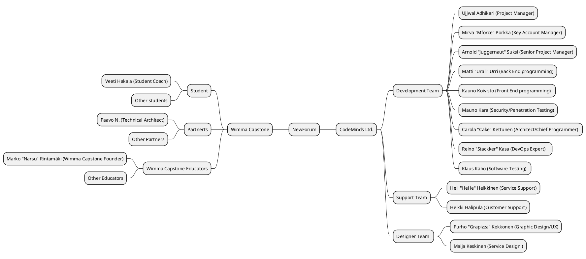
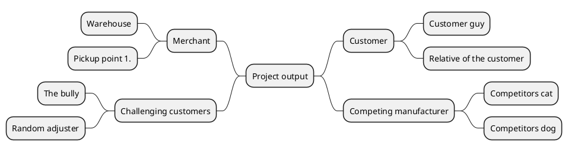
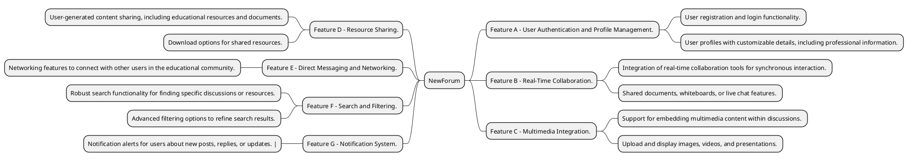
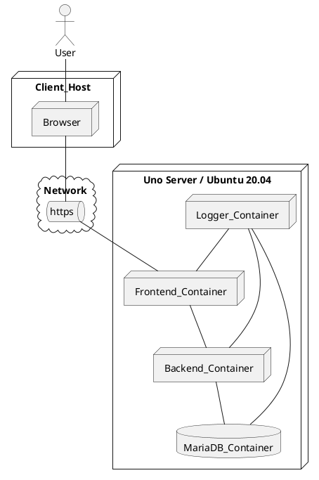

# Short Requirement Specification (template)

|  |  |
|:-:|:-:|
| Document Type | Short Requirement specification |
| Author | Ujjwal Adhikari |
| Version | 1.0 |
| Date | 01.09.2024 |

<!-- >Some hints for the author of the specification! All support videos are moved to excercise description page. Please go through materia if you are stuck. As the work progresses, delete the various instruction texts and replace the example images/video links given by template document. Update information in the tables according information related to the case study assignment. Don't change the captioning drastically, but you can remove the extra nonsense and video links :) 
If you are wondering what was original text in document you can allways find the latest version of short-requirement-specification from [this address](https://jamkit.pages.labranet.jamk.fi/project-templates/en-opf-2021-core-template-v2/20-Requirement-management/short-requirement-specification/)
>Br,
>Teachers -->

## Introduction

<!-- 

>*Let's describe briefly the product/service/software solution, a little background and essentially related things? If you are doing exercise please check if you can use existing stakeholders real names! Otherwise, all names will be changed to self-invented pseudo names* -->

### Forum Service for Wimma Capstone
**Description:**

The Forum Service for Wimma Capstone is a cutting-edge online collaboration platform developed by CodeMinds Ltd. This service is designed to seamlessly integrate with Wimma Capstone's educational platform, creating a dynamic hub for students, educators, and enthusiasts. The forum service goes beyond traditional discussion platforms, offering innovative features to enhance user engagement and knowledge sharing.

**1. User-Centric Experience:**
- Intuitively designed forum for diverse user needs.
- Fosters connection and knowledge sharing among the Wimma Capstone community.

**2. Innovative Collaboration:**
- Real-time collaboration tools for dynamic discussions.
- Interactive multimedia integration for a rich learning experience.

**3. Security Fortress:**
- Robust information security standards to protect user data.
- Regular security updates and proactive measures against cyber threats.

**4. Performance Excellence:**
- Exceptional performance with fast response times and scalability.
- Minimal downtime, even during peak usage periods.

**5. Cost-Effective Brilliance:**
- Streamlined development process for cost-efficient solutions.
- Affordable forum service accessible to educational institutions of all sizes.

**Background:**

Wimma Capstone, an educational project platform, recognized the need to enhance its online learning experience and collaboration. In response to this, CodeMinds took on the responsibility of developing a forum service tailored to Wimma Capstone's unique requirements. The project aimed to adapt educational platforms for remote work, aligning with the evolving landscape of online learning.

**TTOS2070 Guideline Alignment:**

The project aligns with the TTOS2070 Guideline of the Institute of Jyväskylä University of Applied Sciences, showcasing an innovative initiative in software development and project management. This alignment reflects a commitment to contemporary approaches in addressing the challenges of the education technology landscape.

**Industry Impact:**

Wimma Capstone, fueled by CodeMinds' forum service, emerges as an industry leader, setting the standard for effective online collaboration and learning. The collaborative effort showcases the potential of tailored solutions in the competitive and dynamic educational technology industry.

**Conclusion:**

The Forum Service for Wimma Capstone represents a milestone in delivering a customized solution that meets the specific needs of an educational project. This product not only enhances the learning experience for Wimma Capstone users but also positions both CodeMinds and Wimma Capstone as innovators in the field of remote education.

## Focus Group 

<!-- 

>*For whom is the solution / service being developed for? It is worth of briefly highlight the potential end users and the relevant stakeholders who will benefit or have interest on the service* -->

The focus group aims to gather feedback and insights from students using the forum service integrated into Wimma Capstone's educational platform. The goal is to understand their experiences, preferences, and suggestions for improvement.

### Focus Group A (STUDENTS)
The project to develop a forum service for Wimma Capstone, spearheaded by CodeMinds Ltd, offers several potential benefits for students. Here are some ways in which the project could enhance the educational experience for students:

**Collaborative Learning:**
- The forum service creates a platform for collaborative learning, allowing students to engage in discussions, share ideas, and collaborate on projects. This fosters a sense of community and collective knowledge building.

**Innovative Learning Features:**
- The forum service introduces innovative features that go beyond traditional discussion platforms. These features, such as real-time collaboration tools and interactive multimedia integration, make learning more dynamic and engaging for students.

**Access Anytime, Anywhere:**
- The forum service, seamlessly integrated into Wimma Capstone's platform, allows students to access educational discussions and resources anytime, anywhere. This supports remote learning and provides flexibility for students with varying schedules.

**Contribution to Industry Standards:**
- By aligning with the TTOS2070 Guideline of the Institute of Jyväskylä University of Applied Sciences, the project ensures that students are exposed to contemporary approaches in software development and project management, preparing them for industry standards.

### Focus Group B (PARTNERS)

**Real-Time Collaboration:**
- The inclusion of real-time collaboration tools in the forum service enables students to work together on projects, assignments, and group activities. This dynamic collaboration enhances their ability to work as a team and share insights in real-time.

**Enhanced Communication:**
- The forum service facilitates seamless communication between partners and enthusiasts. Everyone can easily connect with peers, ask questions, and participate in discussions, promoting a more interactive and engaging environment.

**Networking Opportunities:**
- The forum serves as a networking hub, enabling everyone to connect with fellow learners and professionals. This networking can lead to valuable opportunities, including mentorship, collaborative projects, and industry connections.

### Focus Group C (Wimma Capstone)
* Wimma Capstone, as a focus group, serves as a representative sample of key stakeholders, including educators, administrators, and potentially students. The purpose is to gather comprehensive feedback, align project goals with Wimma Capstone's mission, and ensure the forum service meets the unique needs of the educational platform.
* Collaboratively explore how the forum service, when integrated, can contribute to Wimma Capstone's strategic position as an industry leader in educational project platforms.

## Stakeholder map

<!-- >*Using a stakeholder map, we can describe what kind of user, stakeholders or other actors are essentially involved with the planned solution/service? All identified stakeholders are depicted as the form of a stakeholder map. The motivation of the stakeholder/actor for solution should also shown in map presentation. The stakeholder map can be created by using different drawing tools like Drawio or PowerPoint. The MindMap format is very handy way to create a map. Try out integrated PlantUML generator. (Recommended option)* -->



<!-- **Storys from the field**

>*When developing a service, it is necessary to find out some background information and understanding of solution domain,  the industry itself or the operating environment considered. This requires information gathering. It is worth af listening the customer and focus groups to understand better ther purpose of product.. The good information source from end user perspec
**tive is valuable for service developer.* 
- *Check out the PlantUML tool mentioned earlier and try creating a stakeholder map related to the product. Instructions can be found at [http:**//plantuml.com/](http://plantuml.com/). Note that because of integratio of PlantUML with Gitlab, the tags @startuml / @enduml-ig notation are using different notation:*

* instead of @startuml use *```plantuml*
* Instead of @enduml use *```*

>The stakeholder description below can be overwritten to see how the chart can be generated using PlantUML.



 -->
## Selected stakeholder profiles

<!--  -->

>The stakeholder map provides an overview of the different actors (actor) that are essentially related to the solution / service. If we take a closer look at different end users of the service, for example, we can see that there are clear differences between them.
Due to this, the description has to be refined and specified and, if necessary, the so-called profile description. This description can be used to more accurately identify the nature of the target group. If necessary, a profile-specific description file can be created to provide a more detailed description. This file can be created by copying the bottom profile description and naming it according to the profile. Detailed descriptions are created as needed. The table below presents a few example profiles and the necessary information can be found in the table.

| ID |  Short name | Description | Motivaatio |
|:-:|:-:|:-:|:-:|
| SR-001 | [Customer profile A - Emily Thompson](../10-Project-management/templates/userstory-emily-thompson.md) | Teenager 13-19 Years | Primary user of service, networking and collaborations |
| SR-002 | [Customer profile B - Allison Weaver](../10-Project-management/templates/userstory-allison-weaver.md) | Adult 22-45 Years |  Occassional need for service  |
| SR-003 | [Stakeholder -Inverstor](../10-Project-management/templates/userstory-investor.md) | Investor | Profits from service |
<!-- | SR-004 | [Stakeholder - Tax Collector]() | Tax man | Collect taxes | -->

## Customer journey paths related to the service
Customer journey paths are the routes that users take when interacting with a service. For the CodeMinds project, developing a forum service for Wimma Capstone, here are potential customer journey paths:

<!-- >Consider the assignment and consider whether its use involves any general events, for example before or after use. How is the service / solution implemented and how is it used as part of the service paths?
>Case description describes a series of events that are performed in a selected situation during the use of the service. There may be several different customer-specific service paths, but the most important thing is to identify the most important ones at the beginning.
>Sim can be used to describe the service path. A Swim Lane or State Machine Diagram or other method deemed appropriate. The key is to describe the path and use it to clarify the understanding of the service sought.
>*Different descriptions are made to achieve a common understanding, not just to the delight of an individual developer*

**A small story**

>*Think about how different people will be selected as users of Play Station/Steam/XBOX/Nintendo gaming systems? What are the criteria for choosing a personal service? Are there clear differences between user groups? What kind of games do these groups appreciate? How does joining the service work in practice? Where can I find a VISA card? Change in your mind the age of the person and you will find that the so-called. customer journey path varies by age! This Is Very Important To Perceive In A Timely Matter As The Service Developer Needs To Consider Different Potential Customers.*

**customer journey path PlantUML example as a state machine**

>What is customer journey path? Do some googling and you will find several examples. 
Try then to sketch an example of journey path using the PlantUML tool. Study first case study assignment and use it as a origin for path. 


**Path description for customer arriving at a retail store and how general data protection issues are affecting on sales process**

>In this path, one can consider how the customer's decision can be confirmed? -->

<!-- ```plantuml
Step1: A description of the service is displayed on the ad screen in the street side window of retail store
Step2: The customer enters the store
Step3: The customer locates a product from the shelf
Step4: The customer asks the salesperson for more information about a product
Step5: The salesperson introduces the product briefly
Step6: The customer does some extra googling about a product
Step7: The customer is ready for accept a product and is ready to buy it
Step8: The customer informs the salesperson and they start to create a contract
Step9: The salesperson recommends also some additional services
Step10: The salesperson asks for the customer’s email address and personal Id number (HETU)
Step11: Because of personal security reasons the customer refuses to hand over personal Id (HETU)
Step12: The salesperson cannot continue with contracting because the customer is not giving needed information.
Step13: The customer leaves the store and a product remains in store

 -->


```plantuml
Step1: Users discover the forum service through social media posts.
Step2: Users discover the forum service through the Wimma Capstone website.
Step3: They learn about the features and benefits of the forum service.
Step4: Potential user ignores.
Step5: Users click on the "Sign Up" button on the forum service page.
Step6: They provide necessary information for registration.
Step7: They dont provide necessary information for registration.
Step8: An onboarding process guides them through setting up their profile and preferences.
Step9: An onboarding process cannot cannot start without providing necessary information for registration.
Step10: Users explore different forum categories and topics.
Step11: User just signed up for seeing Whats going on here.
Step12: They engage in discussions, post questions, or respond to existing threads.
Step13: Users discover innovative features such as real-time collaboration tools and multimedia integration.
Step14: Users actively participate in discussions related to educational projects and innovations.
Step15: They utilize real-time collaboration tools to work on projects with other users.
Step16: Users provide feedback on the forum service, sharing their experience and suggestions.
Step17: Users DOES NOT provide feedback on the forum service, sharing their experience and suggestions.

Step18: CodeMinds collects feedback to make continuous improvements to the forum.
Step19: Users connect with other educational professionals and enthusiasts through the forum.
Step20: Networking features, such as direct messaging, facilitate one-on-one communication.
Step21: Users share educational resources and materials with the community.
Step22: They download resources shared by others.
Step23: Users encounter issues, they visit the support channel on the forum.
Step24: CodeMinds' support team responds to queries and resolves issues promptly.
Step25: Users receive notifications about new forum activity and relevant updates via email or app notifications.
Step26: They stay engaged by participating in ongoing discussions and events.
Step27: Some users may take on leadership roles, becoming moderators or administrators.
Step28: They contribute to maintaining a positive and constructive forum environment.


Step1 --> Step3
Step2 --> Step3
Step1 --> Step4
Step2 --> Step4
Step3 --> Step5
Step5 --> Step6
Step5 --> Step7
Step6 --> Step8
Step7 --> Step9
Step8 --> Step10
Step10 --> Step11
Step11 --> Step12
Step12 --> Step13
Step13 --> Step14
Step14 --> Step15
Step15 --> Step16
Step15 --> Step17
Step16 --> Step18
Step18 --> Step19
Step19 --> Step20
Step20 --> Step21
Step21 --> Step22
Step22 --> Step25
Step22 --> Step23
Step23 --> Step24
Step24 --> Step25
Step25 --> Step26
Step26 --> Step27
Step27 --> Step28
```

## Primary Features

<!-- >Next, consider what are the main functional features of the service? At this point, record them in French lines and create an outline based on them in the form of a MindMap description. The image should allow a clearer picture of the different aspects of the service.
>* Consider, for example, a situation where you are asked what you can do with a service you have developed in practice? You will have 15 seconds to respond. What do you answer?
>* What features do you highlight?
>* Why is your product better than others? -->


**User Registration and Profile Management:**
- Allow users to create accounts and manage their profiles.
- Include profile customization options and the ability to add professional details.

**Discussion Threads and Topics:**
- Enable users to create and participate in discussion threads.
- Categorize discussions into topics for better organization.

**Real-Time Collaboration Tools:**
- Provide tools for real-time collaboration, such as shared documents or whiteboards.
- Enhance user interaction and engagement.

**Multimedia Integration:**
- Support the embedding of multimedia content, including images, videos, and presentations.
- Foster a dynamic and visually rich learning environment.

**Gamification Elements:**
- Integrate gamification elements to encourage user participation.
- Include features like badges, points, and leaderboards to recognize and reward contributions.

**User-Generated Content:**
- Allow users to create and share educational resources, documents, and materials.
- Enable resource uploads and downloads within the forum.

**Direct Messaging and Networking:**
- Facilitate direct messaging between users for private communication.
- Provide networking features to connect with other professionals and enthusiasts.

**Search and Filtering:**
- Implement robust search functionality for users to find relevant discussions and resources.
- Include advanced filtering options to refine search results.

**Notification System:**
- Offer a notification system to alert users about new posts, replies, or relevant updates.
- Support email notifications and in-app alerts.

**Moderation and Administration Tools:**
- Provide moderation features for administrators and moderators to manage content and user behavior.
- Include tools to monitor discussions, remove inappropriate content, and enforce community guidelines.

**Responsive Design:**
- Ensure the forum service has a responsive design for seamless access across various devices.
- Optimize the user interface for both desktop and mobile experiences.

**Accessibility Features:**
- Implement accessibility standards to ensure the platform is usable by individuals with disabilities.
- Provide features like alt text for images and keyboard navigation.

**Customization Options:**
- Allow users to customize their forum experience, such as theme selection or layout preferences.
- Provide options for users to tailor the interface to their preferences.

**Analytics and Reporting:**
- Integrate analytics tools to track user engagement, popular topics, and overall forum performance.
- Provide reporting features for administrators to assess community activity.

**Support and Help Center:**
- Include a dedicated support channel for users to seek assistance.
- Offer a comprehensive help center with FAQs, guides, and tutorials.

**Integration with External Platforms:**
- Integrate with other educational platforms or tools to enhance the overall learning experience.
- Support seamless connectivity with third-part XL-B Py services.

<!--  -->

**Features and Functions**

| **Feature** | **Functinality** |
|:-:|:-:|
| **Feature A** - *User Authentication and Profile Management:* | User registration and login functionality. |
|| User profiles with customizable details, including professional information. |
| **Feature B** - *Real-Time Collaboration* | Integration of real-time collaboration tools for synchronous interaction. |
|| Shared documents, whiteboards, or live chat features. |
| **Feature C** - *Multimedia Integration.* | Support for embedding multimedia content within discussions. |
|| Upload and display images, videos, and presentations. |
| **Feature D** - *Resource Sharing.* | User-generated content sharing, including educational resources and documents. |
|| Download options for shared resources. |
| **Feature E** - *Direct Messaging and Networking.* | Networking features to connect with other users in the educational community. |
| **Feature F** - *Search and Filtering.* | Robust search functionality for finding specific discussions or resources. |
|| Advanced filtering options to refine search results. |
| **Feature G** - *Notification System.* | Notification alerts for users about new posts, replies, or updates. |

**Example in MindMap format and links related functions**

<!--  -->



# Functional Requirements

<!-- >As you noticed there is concept of a *function* which is mainly related to some *feature*. All software functions can be presented and describes as a *functional requirements*.
It can be generally said that all functions of software can be initially recorded as functional requirement, but in practice some of them turn out to be broader than just a function, eg. *Feature*. When gathering and idefining functional requirements, they can be recorded as the form of a table. When documenting a requirements the following conditions should be considered: -->

Capturing functional requirements is a crucial step in the software development process. These requirements define what the software is expected to do and play a vital role in guiding the development team.

* *Requirement must a unique an identified*
* *Requirement must be measurable*
* *The requirement must be unambiguous and clear*
* *The requirement should not include more than one requirement*
* *The claim should be justified if necessary*
* *The claim must not overwrite a previously defined claim*
* *Does the claim actually represent a feature?*

| Requirement Id | Description| Feature |
|:-:|:-:|:-:|
| FUNC-REQ-C0001 | Users should be able to register and log in securely.  | User Management |
| FUNC-REQ-C0002 | Enable real-time collaboration features for shared documents and live chat. | Collaboration Tools |
| FUNC-REQ-C0003 | Allow users to embed images, videos, and presentations within discussions. | Multimedia Support |
| FUNC-REQ-C0004 | Users can share and download educational resources. | User-Generated Content |
| FUNC-REQ-C0005 | Enable private messaging between users for networking. | Networking |
| FUNC-REQ-C0006 | Implement robust search and advanced filtering options. | Content Discovery |
| FUNC-REQ-C0007 | Notify users of new posts, replies, and updates through various channels. | User Alerts |

## User Interface/mockup 

<!-- > Drawings and descriptions produced in different ways can also be used to clarify the different functionalities. The aim is to outline what the product should look like and what things should be taken into account, for example, in the implementation of the user interface. MockUp / prototype drawing tools that serve as online services can be conveniently used for this purpose. These tools make it easy to create a prototype of the interface that can be tested with different audiences.
> Prototype descriptions related to feature implementations should be included in the feature definition documents so that they can be found in the appropriate place. Do some study around an example [Feature - FEA0001](example-feature0001.md)
>Traditionally, UI sketches and descriptions have been made by drawing static images from the UI and have been used as design aids. This is also accomplished by applying PlantUML descriptions as an aid. (see below)
> However, you should check out the current Prototype / MockUp tools for this purpose.


 * [Link to prototype or mockup]() -->

**Example of simple UI layout using PlantUML**

<!-- ```plantuml
salt
{
  Just plain text
  [This is my button]
  ()  Unchecked radio
  (X) Checked radio
  []  Unchecked box
  [X] Checked box
  "Enter text here   "
  ^This is a droplist^
}
``` -->
**Simple Login UI**
```plantuml
salt
{
  Username:
  "Enter Username.        "

  Password:
  "Password               "
                    Show Password []


  [Login]
}
```

**Simple SignUp UI**
```plantuml
salt
{
Full Name:
"Enter Full Name.        "

Date of Birth:
"Enter Date of Birth.    "

Email:
"Enter Email.            "

Password:
"Password                "
[] Show Password

Confirm Password:
"Password                "
[] Show Password


[SignUp]
}
```

**Simple Home page UI**
```plantuml
salt
{
  **username** **date&time**
  *text area*

  **username** **date&time**
  *text area*

  **username** **date&time**
  *text area*

  **username** **date&time**
  *text area*

  **username** **date&time**
  *text area*

  "Start a discussion...                                   "  
  [Upload]
  [Share]
  [Send]
}
```

## Agile Development - User Storys 

<!-- 

>In software development, it is common practice to use descriptions of the needed functions and features by the stakeholders. These suggestions are recorded in the form of a User Story. See [User Story](https://en.wikipedia.org/wiki/User_story). User stories are very important definitions for the development team because they are in practice the tasks to do the implementation for the service. User Stories are foundation for entire development teams during product development.

> The general format of the use story description is:

*As a <-role-> I can <-capability->, so that <-receive benefit ->*

You can link issue with documentation by adding issue id as # and number of it

* *As a user, I want to be able to generate a report on my purchases for the last month, as it makes it easier to manage my finances*  #13
* *As a user, I want to be able to delete my history of purchases from the last month because I don't want to remember the past* #14 -->

* As a **new user**, I want to be able to create an account easily so that I can access personalized features and save my preferences.

* As a **social media user**, I want the option to hide my online status so that I can browse the platform privately.

* As a **project manager**, I want a visual task board to track the progress of tasks in real-time, improving team collaboration and project visibility.

* As a **mobile app user**, I want the application to remember my login credentials so that I can quickly access my account without entering them every time.

* As a **content creator**, I want a spell-check feature in the writing interface to ensure the quality of my articles.

* As a **team member**, I want the ability to easily integrate third-party plugins into our project management tool for enhanced functionality.

* As a **customer support agent**, I want a unified customer interaction history to provide better and more personalized assistance.

* As a **product owner**, I want a prioritized product backlog to help the team focus on high-value features during each sprint.

* As a **system administrator**, I want automated daily backups of critical data to ensure data integrity and easy recovery in case of system failures.

* As a **team lead**, I want a cumulative flow diagram to visualize and analyze the workflow of our Agile development process.

* As a **mobile app user**, I want push notifications for important updates and announcements to stay informed about new features.

* As a **knowledge base editor**, I want version control for articles to track changes and revert to previous versions if necessary.


## About General Requirements for the information system

<!-- >*When designing large-scale information systems / software, requirements can be recorded from different perspectives. In the design of information systems, an image of an iceberg can be used as an analogy, with a part visible on the surface, but a large part (90%) is hidden under water. This applies to information system requirements. When viewed from a high level, the whole may seem clear, but going into detail makes the work more difficult.* 


> -->
The processing of the requirements specification can be seen from two different perspectives.

**Problem Domain (Solution Domain) vs. Solution Domain**
<!-- 
>In other words, the problem field (customer / client's need) must be known with sufficient accuracy so that a suitable solution can be developed (eg software service)
>Different forms of information system requirements can be, for example
> * Customer Needs
> * Business Requirements / Needs
> * System Requirements
> * Sub-System Requirement
> * Component Requirements

>In terms of the course, the focus is on identifying functional requirements, non-functional requirements (performance, security and accessibility)
>* [Requirements definition in Wikipedia](https://en.wikipedia.org/wiki/Requirements_analysis) -->

**Problem Domain:**
- The problem domain refers to the area or subject area where a problem exists or a need arises.
- It encompasses the real-world situation or business process that the software or system aims to address.
- Understanding the problem domain involves identifying stakeholders, their needs, and the constraints or challenges they face.
- The focus is on comprehending the complexities, rules, and intricacies of the specific problem or business context.

**Solution Domain:**
- The solution domain is the realm where the proposed system or software solution exists.
- It involves the design, development, and implementation of the solution to address the identified problem in the problem domain.
- In the solution domain, technical specifications, architectures, algorithms, and software components are defined and created.
- The focus is on building a system or software application that effectively addresses the issues identified in the problem domain.

**1. Functional Requirements:** 
- Define specific functionalities and features that the system must possess to meet the needs of its users.
- Describes what the system should do in terms of inputs, processes, and outputs.

**2. Non-functional Requirements:**
- Specify criteria that are not directly related to specific behaviors or functions but are essential for overall system performance and user experience.
- Include aspects such as performance, scalability, reliability, security, and usability.

**Traceability of requirements**

<!-- >Different forms of requirements can at the product being developed from different perspectives, but requirements between different levels can be related. These are called Traceablity.
>Different forms of requirements can look at the product being developed from different perspectives, but requirements between different levels can be related.
These connections are called Traceablity.

>* *Customer Need CUST001* -> *Feature FEA001* --> 

**Business Objective:**
- **Objective:** Expand Wimma Capstone's user base and adapt education platforms for remote work and online learning.
- **Traceability:** This objective traces to the high-level business requirement of developing a forum service.

**High-Level Business Requirement:**
- **Objective:** Develop a forum service for seamless integration into Wimma Capstone's website.
- **Traceability:** Traced to user requirements for the forum service.

**User Requirement:**
- **Objective:** Users should have an intuitive, user-centric forum experience.
- **Traceability:** Traced to system requirements for the forum service interface.

**System Requirement:**
- **Objective:** Ensure the forum service is secure, scalable, and performs well.
- **Traceability:** Traced to specific design specifications for security measures and scalability.

**Design Specification:**
- **Objective:** Create a sleek and accessible forum interface with innovative features.
- **Traceability:** Traced to the implementation phase for back-end and front-end programming.

**Implementation:**
- **Objective:** Develop and implement programming for the forum service.
- **Traceability:** Traced back to design specifications and forward to the testing phase.

**Testing:**
- **Objective:** Ensure the forum service meets all specified requirements.
- **Traceability:** Traced back to system requirements and forward to the deployment phase.

**Deployment:**
- **Objective:** Integrate the forum service seamlessly into Wimma Capstone's website.
- **Traceability:** Traced back to the implementation phase and forward to ongoing support.

**Ongoing Support:**
- **Objective:** Provide continuous support for forum service users.
- **Traceability:** Traced back to the deployment phase and forward to potential future enhancements.

**Change Management:**
- **Objective:** Manage changes and updates to the forum service.
- **Traceability:** Traced back to ongoing support and forward to potential impact on system requirements.

## Technical requirements related to the service

 When defining comprehensive software services, it's crucial to identify and define the necessary technologies, hardware, and subsystems needed for the operation of the service.

* A few hardware requirements have been recorded as an example.

| ID | Description | 
|:-:|:-:|
| HW-REQ-0001 |  The server environment is a critical component for hosting the software service. It includes the physical or virtual servers responsible for running the application. |
| HW-REQ-0002 | The database system manages and stores the service's data. It's vital for data storage, retrieval, and management. |
| HW-REQ-0003 | The database system manages and stores the service's data. It's vital for data storage, retrieval, and management. |
| HW-REQ-0004 |  Networking infrastructure is essential for communication between different components of the system and with external services or users. |
| HW-REQ-0005 | Security is a critical aspect of any software service. It includes measures to protect against unauthorized access, data breaches, and other security threats. |

## Non-functional Requirements

<!-- >Non-functiona requirements are large collection of different concepts. Functional requirements only cannot describe a software wide enough. There is several different categorys of [No-Functional Requirements](https://en.wikipedia.org/wiki/Non-functional_requirement). Sounds suddenly awkward, but think about the following questions?

* *How can a product be developed to be safe for user? Are there any requirements that need to be met because of this? (safety)*
* *What matters must be ensured to ensure that the product is acceptable to the authorities? (compatibility-conformance)*
* *How many users can using the service at one time (performance-performance)*
* *Will the service in future be available for a wider user space (scalability)*
* *Is there a need for different language versions (accessibility)*
* *What needs to be taken into account when developing the service in future? (maintainability)*
* *What technologies should be used? (Maintainability)*

We have selected some common ones to focus with: 

* *Performance Requirement*
* *Security Requirement*
* *Accessability Requirement* -->

Non-functional requirements are aspects of a software system that describe how it behaves, rather than what functions it performs. These requirements are crucial for ensuring the overall quality, usability, and performance of the software.

We have selected some common ones to focus with: 

* *Performance Requirement*
* *Security Requirement*
* *Accessability Requirement*

### Performance Requirements

Performance requirements define the criteria that a software system must meet in terms of speed, responsiveness, and overall efficiency. These requirements are crucial for ensuring that the system performs well under various conditions.

<!-- >What are the performance requirements for the service? What does eg. performance oriented load testing covers (https://en.wikipedia.org/wiki/Load_testing) -->

| ID | Description |
|:-:|:-:|
| PERF-REQ-0000 | The system should respond to user actions within 2 seconds. |
| PERF-REQ-0001 | The system should handle a minimum of 1000 transactions per minute. |
| PERF-REQ-0002 | The system should scale horizontally to support a 20% increase in concurrent users. |
| PERF-REQ-0003 | The system should support 1000 concurrent users during peak hours. |
| PERF-REQ-0004 | The system should distribute incoming traffic evenly across servers to maintain optimal performance. |
| PERF-REQ-0005 | Database queries should return results within 1 second. |
| PERF-REQ-0006 | Frequently accessed data should be cached to reduce response time. |
| PERF-REQ-0007 | The system should have a maximum network latency of 50 milliseconds. |
| PERF-REQ-0008 |  The system should not exceed 80% CPU utilization under normal operating conditions. |
| PERF-REQ-0009 | The system should undergo scalability testing to verify its ability to handle increased load. |
| PERF-REQ-0010 | The system should undergo stress testing to evaluate its performance under extreme conditions. |

### Security Requirements
<!-- 

>Remember to study first about non-functional requirements. 
>What are the requirements for the service from a security perspective? Read more [VAHTI 1/2013 Application Development Information Security Guide] -->

Security requirements are essential for safeguarding a software system, protecting sensitive data, and preventing unauthorized access or malicious activities.


| ID |  Description |
|:-:|:-:|
| SECURITY-REQ-0001 | Users must authenticate using a secure username and password. |
| SECURITY-REQ-0002 | Role-based access controls must be implemented to define user permissions. |
| SECURITY-REQ-0003 | All sensitive data must be encrypted during transmission (HTTPS) and at rest. |
| SECURITY-REQ-0004 | Secure session management practices must be implemented to prevent session hijacking. |
| SECURITY-REQ-0005 | The system must maintain an audit trail of user activities, logins, and critical events. |
| SECURITY-REQ-0006 |  Enforce strong password policies, including complexity and expiration requirements. |
| SECURITY-REQ-0007 | Regularly apply security patches and updates to all system components. |
| SECURITY-REQ-0008 | Implement intrusion detection and prevention mechanisms to detect and block malicious activities. |
| SECURITY-REQ-0009 | Configure firewalls to restrict unauthorized access and monitor incoming and outgoing traffic. |
| SECURITY-REQ-0010 | If the system uses APIs, they must be secured with authentication and authorization mechanisms. |
| SECURITY-REQ-0011 | Regularly conduct vulnerability scanning and penetration testing. |
| SECURITY-REQ-0012 | Develop and maintain an incident response plan to address security incidents. |
| SECURITY-REQ-0013 | Implement regular data backup procedures and ensure a robust recovery plan. |
| SECURITY-REQ-0014 | Provide security awareness training for employees and users. |
| SECURITY-REQ-0015 | Ensure compliance with relevant laws and industry-specific security standards. |

### Accessablity Requirements

<!-- 

 >Remember to study first about non-functional requirements. 
>What is meant with concept of accessibility? What kind of issues/instructions must be taken into account when implementing the service? Check out some examples: [https://www.w3.org/WAI/fundamentals/accessibility-usability-inclusion/](https://www.w3.org/WAI/fundamentals/accessibility-usability-inclusion/) -->

Accessibility requirements ensure that a software system is designed and developed to be inclusive and usable by individuals with diverse abilities and disabilities.

| ID  |  Description |
|:-:|:-:|
| ACCESS-REQ-0000 | All functionality must be operable using a keyboard interface. |
| ACCESS-REQ-0001 | The system must be compatible with screen reader software for users with visual impairments. |
| ACCESS-REQ-0002 |  All non-text content, such as images and multimedia, must have text alternatives. |
| ACCESS-REQ-0003 | Text and images must have sufficient contrast to be readable by users with low vision. |
| ACCESS-REQ-0004 | Users must be able to resize text without loss of content or functionality. |
| ACCESS-REQ-0005 | Ensure sufficient color contrast between text and background elements. |
| ACCESS-REQ-0006 | Clearly indicate the focus state for interactive elements. |
| ACCESS-REQ-0007 | Provide a mechanism to skip repetitive navigation and go directly to the main content. |
| ACCESS-REQ-0008 | Ensure forms are accessible, with proper labeling and instructions. |
| ACCESS-REQ-0009 | Provide captions for multimedia content and transcripts for audio content. |
| ACCESS-REQ-0010 | Maintain consistent navigation and layout throughout the application. |
| ACCESS-REQ-0011 | Use clear and legible fonts with adjustable font sizes. |
| ACCESS-REQ-0012 | Ensure error messages are clearly presented and provide guidance for resolution. |
| ACCESS-REQ-0013 | Ensure compatibility with common assistive technologies, such as screen readers and magnifiers. |
| ACCESS-REQ-0014 | Conduct usability testing with individuals with diverse abilities to gather feedback. |

## Constraints and legal issues

<!-- >The implementation and use of different software/services is often governed by laws and regulations. The requirements required by these are recorded in the requirements definition as restrictions. The effect of Constraints may apply to the implementation of some part of the service as a whole. For this reason, the various constraints need to be identified in time, as the impact may be quite decisive in the longer term. An example of this is the [EU GDPR Act](https://en.wikipedia.org/wiki/General_Data_Protection_Regulation), which entered into force last year. -->


| ID |  Description | Affects on |
|:-:|:-:|:-:|
| CONSTRAIN-000 |  Laws and regulations govern the development and use of software/services. These constraints may include data protection laws, intellectual property regulations, accessibility requirements, and industry-specific compliance standards. | Failure to comply with legal constraints can result in legal action, fines, or reputational damage. Identifying these constraints early ensures that the software/service aligns with applicable laws and regulations. |
| CONSTRAIN-001 | Constraints related to the technology stack, compatibility, and integration with existing systems. These constraints may be influenced by the client's technology preferences or industry standards. | Ignoring technological constraints can lead to interoperability issues, system failures, or increased development and maintenance costs. Early identification allows for proper planning and technology selection. |
| CONSTRAIN-002 | Financial limitations imposed on the project, including budget constraints, cost considerations, and funding availability. | Ignoring budgetary constraints can lead to cost overruns, financial instability, or compromised project quality. Early identification enables effective resource allocation and budget management. |
| CONSTRAIN-003 | Restrictions on project timelines, delivery schedules, or specific deadlines. | Ignoring time constraints can result in project delays, missed opportunities, or dissatisfaction among stakeholders. Early identification allows for realistic scheduling and timeline adjustments. |
| CONSTRAIN-004 | Limitations related to the availability of skilled personnel, equipment, or external resources.
 | Ignoring resource constraints can lead to resource shortages, increased workloads, or compromised project quality. Early identification facilitates strategic resource planning.
 |
| CONSTRAIN-005 | Requirements related to the security and privacy of user data. | Ignoring security and privacy constraints can lead to data breaches, legal consequences, or loss of user trust. Early identification ensures the implementation of robust security measures. |

## Software Architecture

<!-- >If necessary, technical descriptions can be included as part of the specification to help specify the different requirements. One important document can be, for example, technical architecture. This description, in its short form, can be included as part of the requirements definition, but is usually a fairly extensive independent part of the documentation. The architecture for describing solutions can be developed using various diagrams of the UML markup language. An example below is the placement view ([Deployment Diagram](https://plantuml.com/deployment-diagram)). The placement view can be used to describe how the different services in a service are located and how they are connected to each other.

The description of software architecture is in itself a broad aspect and in practice requires more extensive documentation.

* [Link to a software architecture specification](../30-Architecture-and-design/architecture-and-design.md) -->

Software architecture is a structured framework used to conceptualize software elements, relationships, and properties. It involves making design decisions to ensure a system's quality attributes, such as performance, security, modularity, and maintainability.



## Standards and sources

<!-- > Collection of all refered stands and references as a table -->
When it comes to software architecture, there are several industry standards, best practices, and reputable sources that provide guidance and principles. Here are some key standards and sources related to software architecture:


| ID | Short name | Link | Description |  
|:-:|:-:|:-:|:-:|
| REF1 | IEEE 830-1998 | [IEEE 830-1998](https://standards.ieee.org/standard/830-1998.html) | Recommended Practice for Software Requirements Specifications |
| REF2 | IEC 62366-1:2015 | [IEC 62366-1:2015]()  | Application of usability engineering to medical devices | 
| REF3 |  Directive (EU 2016/2102) | [ WEB Accessabilty](https://eur-lex.europa.eu/legal-content/EN/TXT/HTML/?uri=CELEX:32016L2102&from=EN) | The Web Accessibility Directive |
| REF4 |  GDPR directive | [GDPR directive](https://eur-lex.europa.eu/legal-content/EN/TXT/HTML/?uri=CELEX:32016R0679&from=EN) | General Data Protection Regulation |


